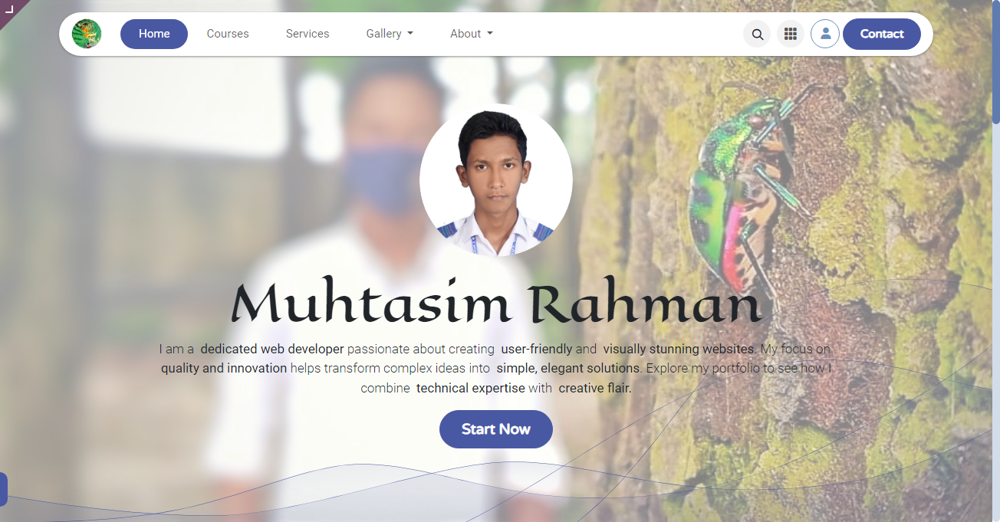
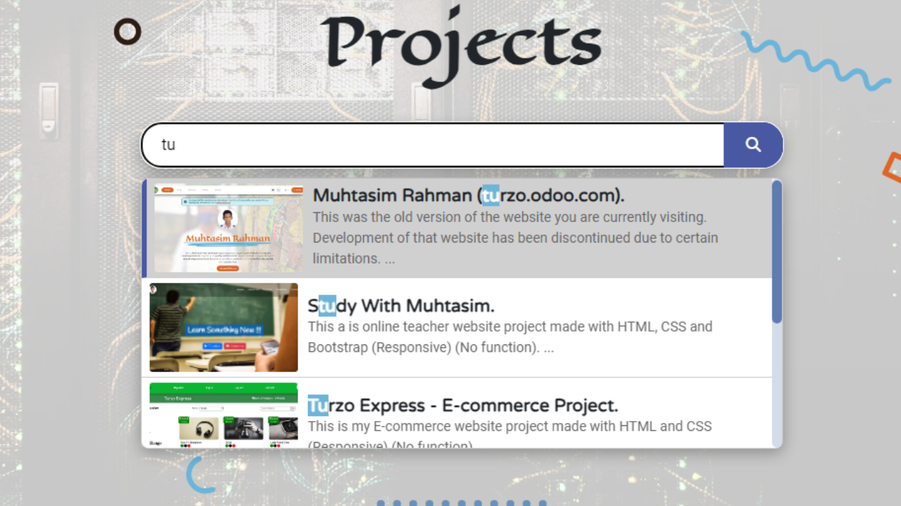
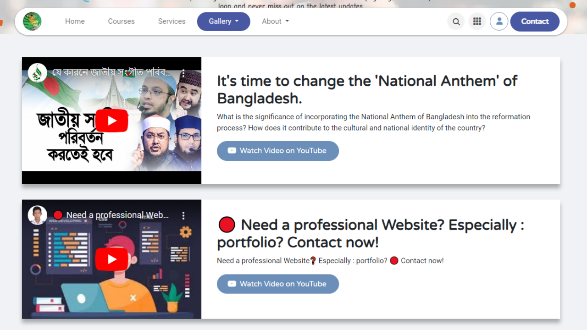
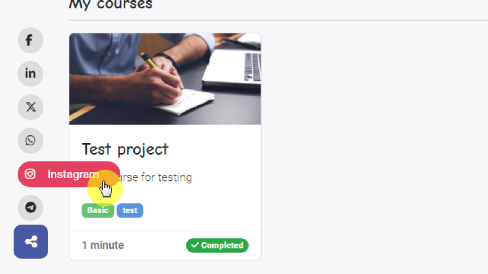
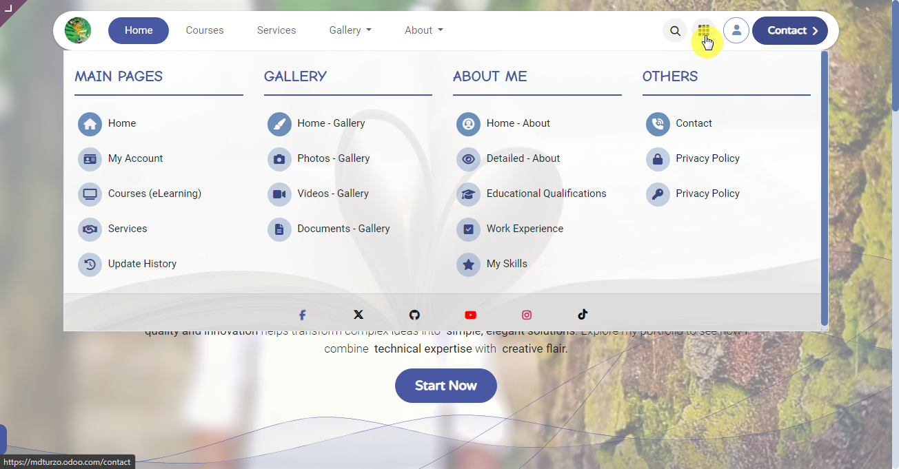

# Odoo Website Assets

Welcome to the **Odoo Website Assets Repository**, a comprehensive collection of bespoke stylesheets and JavaScript files designed to enhance the functionality of my diverse range of projects.

# Folder: _mdturzo.odoo.com_

The assets under the **mdturzo.odoo.com** directory are responsible for powering the website **[mdturzo.odoo.com](https://mdturzo.odoo.com).**



---

## 🌟 Overview

The website **[mdturzo.odoo.com](https://mdturzo.odoo.com)** is designed with modern web principles and a clean, user-friendly interface. This approach leverages external CSS and JavaScript files, fostering a development workflow that is both adaptable and easy to manage, utilizing resources from this repository while prioritizing responsiveness, performance, and captivating interactive elements.

## 🔑 Key Features:

- **Fully Responsive Design**: Adapts to all devices—mobile, tablet, desktop.
- **Integration of External Assets**: Utilizing shared CSS and JavaScript files for simplified updates.
- **Optimized Performance**: Lightweight and efficient, minimizing load times.
- **SEO Friendly**: Built with search engine optimization in mind.

---

## 🖼️ Website Screenshots

Here are visual elements of the website enhanced with repository assets. The modern, minimalist design ensures a smooth experience on all devices.

<div style="text-align: center;">
  
  
  
  
</div>

---

<style>
  .responsive-img {
    display: inline-block;
    padding: 5px;
  }
  @media (max-width: 700px) { 
    .responsive-img { width: 100%; }
  }
  @media (min-width: 701px) and (max-width: 1099px) { 
    .responsive-img { width: 48%; }
  }
  @media (min-width: 1100px) { 
    .responsive-img { width: 23%; }
  }
</style>

## 📦 How to Use

You can implement the external styles and scripts hosted in this repository by including the following in your HTML files:

### CSS files:

```html
<!-- External CSS by 'Muhtasim Rahman'-->
<link
  rel="stylesheet"
  href="https://muhtasim-rahman.github.io/odoo-website-assets/mdturzo.odoo.com/styles.css"
/>
```

### JavaScript files:

```html
<!-- External JavaScript by 'Muhtasim Rahman'-->
<script src="https://muhtasim-rahman.github.io/odoo-website-assets/mdturzo.odoo.com/scripts.js"></script>
```

---

## 🤝 Contributing

We welcome contributions from developers interested in enhancing the project. You can fork this repository, create a new branch for your changes, and submit a pull request. Here’s how you can contribute:

1. Fork the repository.
2. Create a new branch (`git checkout -b new-feature`).
3. Make your changes and commit them (`git commit -m "A short title for your changes"`).
4. Push to the branch (`git push origin new-feature`).
5. Create a pull request.

---

## 🌐 Follow on:

- **YouTube Channel** : [https://www.youtube.com/@mdturzo999](https://www.youtube.com/@mdturzo999)
- **Facebook Page**: [https://www.facebook.com/mdturzo.fb](https://www.facebook.com/mdturzo.fb)
- **GitHub**: [https://www.github.com/muhtasim-rahman](https://www.github.com/muhtasim-rahman)
- **Instagram**: [https://www.instagram.com/mdturzo999](https://www.instagram.com/mdturzo999)
- **Twitter (X)**: [https://x.com/mdturzo999](https://x.com/mdturzo999)
- **Threads**: [https://www.threads.net/mdturzo999](https://www.threads.net/mdturzo999)
- **TikTok**: [https://www.tiktok.com/@mdturzo16](https://www.tiktok.com/@mdturzo16)

---

## 📧 Contact

For questions, suggestions, or more information, feel free to reach out:

- **Website**: [mdturzo.odoo.com/contact](https://mdturzo.odoo.com/contact)
- **Email**: [programmer.turzo@gmail.com](mailto:programmer.turzo@gmail.com)
- **WhatsApp**: [https://wa.link/bnm8o4](https://wa.link/bnm8o4)
- **Messenger**: [m.me/mdturzo.fb](https://m.me/mdturzo.fb)

---

## ⚠️ Disclaimer

This repository is currently under development, and more files will be added over time to cater to different functionalities of the website. Always ensure you are using the latest version of the files for compatibility and performance.

---

Thank you for visiting the **Odoo Website Assets** repository!
